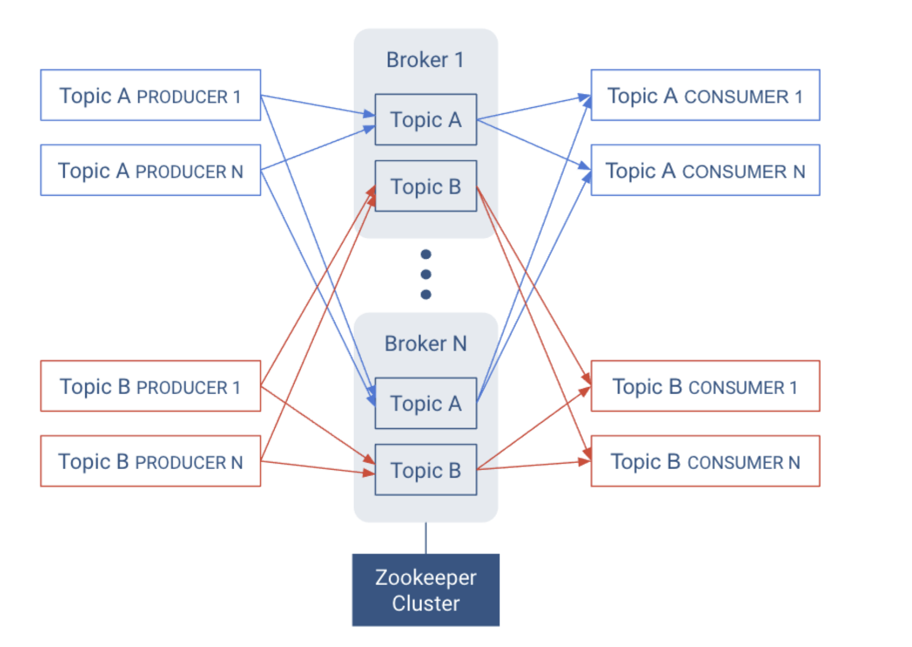
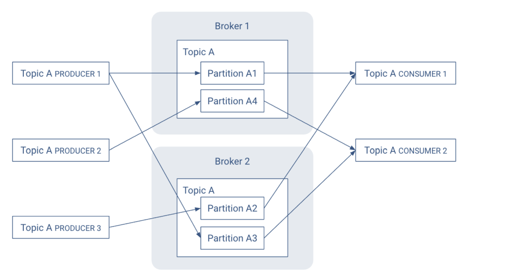
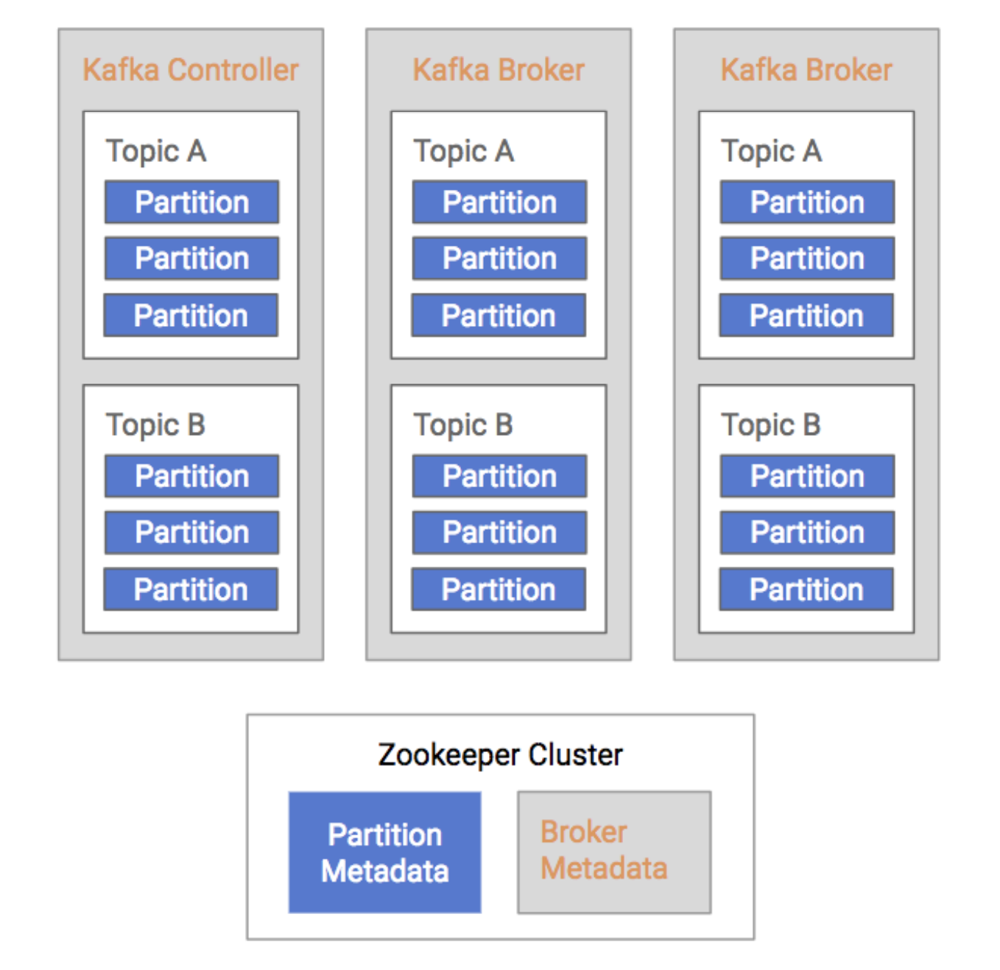

Apache Kafka is a distributed publish-subscribe messaging system that can handle a high volume of data and enables you to pass messages from one end-point to another. Kafka is suitable for both offline and online message consumption. Kafka messages are persisted on the disk and replicated within the cluster to prevent data loss. Kafka is built on top of the ZooKeeper synchronization service. It integrates very well with Apache Storm and Sparks for real-time #streaming 

https://kafka.apache.org/

[Kafka Python Tutorial for Fast Data Architecture — AdminTome Blog | by Bill Ward | AdminTome | Medium](https://medium.com/admintome/kafka-python-tutorial-for-fast-data-architecture-admintome-blog-430097e5af2e)

Kafka has better throughput, built-in partitioning, replication, and inherent fault-tolerance, which makes it a good fit for large-scale message processing applications.

Kafka is very fast and guarantees zero downtime and zero data loss.

Kafka stores key-value messages that come from arbitrarily many processes called producers. The data can be partitioned into different partitions within different topics. Within a partition, messages are strictly ordered by their offsets (the position of a message within a partition) and indexed and stored together with a timestamp.

Other processes called consumers can read messages from partitions. For stream processing, Kafka offers the Streams API that allows writing Java applications that consume data from Kafka and write results back to Kafka.

Kafka runs on a cluster of one or more servers (called brokers), and the partitions of all topics are distributed across the cluster nodes. Additionally, partitions are replicated to multiple brokers. This architecture allows Kafka to deliver massive streams of messages in a fault-tolerant fashion.

## Topics

A topic is a queue of messages written by one or more producers and read by one or more consumers. A topic is identified by its name. This name is part of a global namespace of that Kafka cluster. Specific to Kafka:

-   Publishers are called producers. 
-   Subscribers are called consumers.

As each producer or consumer connects to the publish-subscribe system, it can read from or write to a specific topic. A topic allows easy matching between publishers and subscribers.


## Brokers

Kafka is a distributed system that implements the basic features of the ideal publish-subscribe system described above. Each host in the Kafka cluster runs a server called a broker that stores messages sent to the topics and serves consumer requests.

Kafka is designed to run on multiple hosts, with one broker per host. If a host goes offline, Kafka does its best to ensure that the other hosts continue running. This solves part of the “No Downtime” and “Unlimited Scaling” goals from the ideal publish-subscribe system. Kafka brokers all talk to Zookeeper for distributed coordination, additional help for the "Unlimited Scaling" goal from the ideal system. 

Topics are replicated across brokers. Replication is an important part of “No Downtime,” “Unlimited Scaling,” and “Message Retention” goals. There is one broker that is responsible for coordinating the cluster. That broker is called the Leader or Controller. As mentioned earlier, an ideal topic behaves as a queue of messages. In reality, having a single queue has scaling issues. Kafka implements partitions for adding robustness to topics.



## Records

In Kafka, a record is publish-subscribe message. A record consists of a key/value pair and metadata including a timestamp. The key is not required, but can be used to identify messages from the same data source. Kafka stores keys and values as arrays of bytes. It does not otherwise care about the format.

## Partitions

Instead of all records handled by the system being stored in a single log, Kafka divides records into partitions. Partitions can be thought of as a subset of all the records for a topic. When a topic is created, it is configured with two properties:

1.  Partition count → The number of partitions that records for this topic will be spread among.
2.  Replication factor→ The number of copies of a partition that are maintained to ensure consumers always have access to the queue of records for a given topic.

Each topic has one leader partition. If the replication factor is greater than one, there will be additional follower partitions. (For the replication factor = M, there will be M-1 follower partitions.) Any Kafka client (a producer or consumer) communicates only with the leader partition for data.



## Kafka Brokers and Zookeeper 

The broker, topic, and partition information are maintained in Zookeeper. In particular, the partition information, including partition and replica locations, updates fairly frequently. Because of frequent metadata refreshes, the connection between the brokers and the Zookeeper cluster needs to be reliable. Similarly, if the Zookeeper cluster has other intensive processes running on it, that can add sufficient latency to the broker/Zookeeper interactions to cause issues.

-   Kafka Controller maintains leadership via Zookeeper (shown in orange)
-   Kafka Brokers also store other relevant metadata in Zookeeper (also in orange)
-   Kafka Partitions maintain replica information in Zookeeper (shown in blue)

 


## Kafka CLI commands

Here are some helpful commands if you want to start experiementing:

```shell
# Start Kafka  
$KAFKA_HOME/bin/kafka-server-start.sh config/server.properties
# Stop Kafka  
$KAFKA_HOME/bin/kafka-server-start.sh --zookeeper 192.168.128.252:2181
# Create a topic  
$KAFKA_HOME/bin/kafka-topics.sh --create -zookeeper localhost:2181 --replication-factor 1 --partitions 1 --topic test
# List created topics  
$KAFKA_HOME/bin/kafka-topics.sh --list --zookeeper localhost:2181
# Produce messages  
$KAFKA_HOME/bin/kafka-console-producer.sh --broker-list localhost:9092 --topic test < myMessage.json
# Consume messages in a topic  
$KAFKA_HOME/bin/kafka-console-consumer.sh --bootstrap-server localhost:9092 --from-beginning --topic test
# Reset topic  
$KAFKA_HOME/bin/kafka-configs.sh --zookeeper localhost:2181 --alter --entity-type topics --entity-name test --add-config retention.ms=1000 sleep 3  
$KAFKA_HOME/bin/kafka-configs.sh --zookeeper localhost:2181 --alter --entity-type topics --entity-name test --delete-config retention.ms
```

