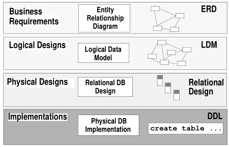

# Technological concepts
## Data Architecture

## Data Process

### Data Warehouse (DW, DWH, EDW)
System used for reporting and data analysis, considered as core component of business intelligence.  DW is central repository of integrated data from one or more disparate sources. Stores data (current and historical) used for analytical reports.

Two main approaches creating warehouses:
- **Bill Inmon approach** - star schema mapping, not deployed until concept invented
- **Ralph Kimball approach** - to keep customers happy, deploy warehouses as modules

Data Mart = layer of Data Warehouse
## Data Cardinality (czech transl. "Mohutnost dat")
| left | right | relation name  | example
|------|-------|----------------|---------
| 1 | 1 | one-to-one | person ←→ id card
| 0..1 | 1 | optional on one side one-to-one | driving license id ←→ person
| 0..* or * | 0..* or * | optional on both sides many-to-many | person ←→ book
| 1..* | 1 | many-to-one | person ←→ birth place

## SQL Structure
- DDL (Data Definition Language) [Wiki](https://en.wikipedia.org/wiki/Data_definition_language)
    - create
    - drop
    - alter
    - rename
- DML (Data Manipulation Language) [Wiki](https://en.wikipedia.org/wiki/Data_manipulation_language)
    - insert ( *insert into table_name (col1, col2) values ("str_val", int_val)* )
    - update ( *update table_name set col1 = "new_value" where id = 1* )
    - delete ( *delete form table_name* )
    - select ( *select col1, col2 form table_name* )
- DCL (Data Control language Language) [Wiki](http://github.com)
    - grant
    - revoke

