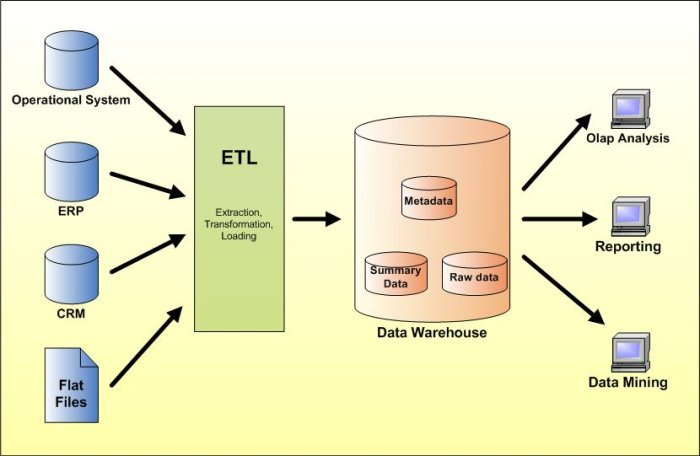

## ETL

  
• Extract data from homogeneous or heterogeneous data sources  
• Transform the data for storing it in proper format or structure for querying and analysis purpose  
• Load it into the final target (database, more specifically, operational data store, data mart, or data warehouse)  
  
10 Open Source ETL [http://www.datasciencecentral.com/profiles/blogs/10-open-source-etl-tools](http://www.datasciencecentral.com/profiles/blogs/10-open-source-etl-tools)
15 Best ETL in 2020 [https://www.softwaretestinghelp.com/best-etl-tools/](https://www.softwaretestinghelp.com/best-etl-tools/)
Top 35 ETL Software [https://www.predictiveanalyticstoday.com/top-free-extract-transform-load-etl-software/](https://www.predictiveanalyticstoday.com/top-free-extract-transform-load-etl-software/)
Open Source ETL: Apache NiFi vs Streamsets [http://www.datasciencecentral.com/xn/detail/6448529:BlogPost:715496](http://www.datasciencecentral.com/xn/detail/6448529:BlogPost:715496)

ETL best Practices [https://www.timmitchell.net/etl-best-practices/](https://www.timmitchell.net/etl-best-practices/)

## Whole Process

Informatica (leader) [https://www.informatica.com](https://www.informatica.com)
Talend Open Source Data Integrator [https://sourceforge.net/projects/talend-studio/](https://sourceforge.net/projects/talend-studio/)
Pentaho Data Integrator - Kettle [http://community.pentaho.com/projects/data-integration/](http://community.pentaho.com/projects/data-integration/)
Dataiku [https://www.dataiku.com/?utm_source=predictiveanalytics](https://www.dataiku.com/?utm_source=predictiveanalytics)
RapidMiner [https://rapidminer.com/?utm_source=PredictiveAnalyticsToday&utm_medium=Review&utm_campaign=PAT](https://rapidminer.com/?utm_source=PredictiveAnalyticsToday&utm_medium=Review&utm_campaign=PAT)  
Spago [https://www.spagoworld.org/?utm_source=PredictiveAnalyticsToday&utm_medium=Review&utm_campaign=PAT](https://www.spagoworld.org/?utm_source=PredictiveAnalyticsToday&utm_medium=Review&utm_campaign=PAT)  
Scriptella [https://codebeamer.com/cb/wiki/938267](https://codebeamer.com/cb/wiki/938267)
Jaspersoft ETL [https://community.jaspersoft.com/project/jaspersoft-etl](https://community.jaspersoft.com/project/jaspersoft-etl)
GeoKettle [http://www.spatialytics.org/projects/geokettle/](http://www.spatialytics.org/projects/geokettle/)
CloverETL [http://www.cloveretl.com/products/open-source](http://www.cloveretl.com/products/open-source)  
HCPP Systems [https://hpccsystems.com/](https://hpccsystems.com/)
Jedox [https://www.jedox.com/en/](https://www.jedox.com/en/)
Apatar [https://sourceforge.net/projects/apatar/](https://sourceforge.net/projects/apatar/)

