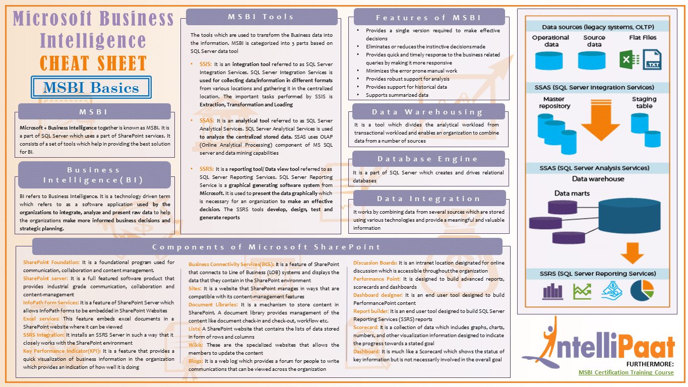

- [Microsoft SQL Server](./SQLServ/Microsoft%20SQL%20Server.md)
- MS Azure ([Types of Databases on Azure](https://azure.microsoft.com/en-us/products/category/databases/))
	- [Azure Cosmos DB - NoSQL and Relational Database](https://azure.microsoft.com/en-us/products/cosmos-db/)
	- [MS Azure SQL](MS%20Azure%20SQL.md) - Cloud relational database
	- [MS Azure Synapse](MS%20Azure%20Synapse.md) - Cloud analytics
- Microsoft Business Intelligence
- [Microsoft Excel](./Excel/MS%20Excel.md)
- [Microsoft Fabric](MS%20Fabric.md)
- [Microsoft Access](./Access/MS%20Access.md)
- [Microsoft PowerBI](./PowerBI/PowerBI.md)
- [Project Sophia](https://projectsophia.microsoft.com/)

[decalage2/oletools: oletools - python tools to analyze MS OLE2 files (Structured Storage, Compound File Binary Format) and MS Office documents, for malware analysis, forensics and debugging.](https://github.com/decalage2/oletools)

[Product Availability by Region](https://azure.microsoft.com/en-us/explore/global-infrastructure/products-by-region/table)

