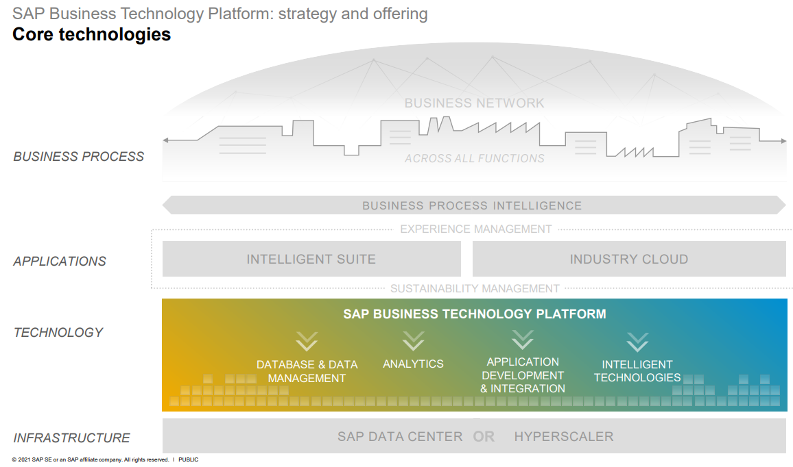

# SAP Business Technology Platform

- Database & Data Management
	- SAP Data Warehouse Cloud ([SAP DWC](SAP%20DWC.md))
	- SAP HANA Cloud
	- ...
- Analytics
	- SAP Analytics Cloud ([SAP Analytics](SAP%20Analytics.md))
	- [SAP Crystal Solutions](https://www.sap.com/cz/products/technology-platform/crystal-bi.html)
	- ...
- Application Development & Integration
	- SAP Business Application Studio (BAS)
	- SAP Integration Suite
		- [SAP Integration Suite Pricing model](https://discovery-center.cloud.sap/serviceCatalog/integration-suite?region=all&tab=service_plan)
	- [SAP BTP Cockpit - SAP Business Technology Platform ondemand.com https://account.hana.ondemand.com](https://www.google.com/url?sa=t&rct=j&q=&esrc=s&source=web&cd=&cad=rja&uact=8&ved=2ahUKEwjZ4dvr_cz9AhWQg_0HHdI3BkgQFnoECAwQAQ&url=https%3A%2F%2Faccount.hana.ondemand.com%2F&usg=AOvVaw1TIeE9WR7hH4U0nTsi0447)
	- ...
- Intelligent Technologies
	- SAP iRPA, ...

SAP Cloud Platform, SAP HANA service: Next Gen Transactional & Analytical Processing in the Cloud [https://blogs.saphana.com/2018/06/04/sap-cloud-platform-sap-hana-service-next-gen-transactional-analytical-processing-in-the-cloud/](https://blogs.saphana.com/2018/06/04/sap-cloud-platform-sap-hana-service-next-gen-transactional-analytical-processing-in-the-cloud/)  

Discover Why SAP Cloud Platform Stands Out From the Pack [https://blogs.saphana.com/2018/05/23/discover-sap-cloud-platform-stands-pack/](https://blogs.saphana.com/2018/05/23/discover-sap-cloud-platform-stands-pack/)

CAP (SAP Cloud Application Programming Model) is a framework of languages, libraries and tools for building services and applications.
[capire - About CAP (cloud.sap)](https://cap.cloud.sap/docs/about/)

CDS (Core Data Services) is the backbone of CAP.
[capire - Core Data Services (CDS) (cloud.sap)](https://cap.cloud.sap/docs/cds/)

**Decission Making approaches**:
- Linear (IT-led)
	- Historical
	- Static
	- Top-down and costly
- Dynamic (Analyst-led)
	- Self-service
	- Fast iterations
	- Distributed
- Augmented (AI-driven)
	- Inc context
	- Instantaneous adjustments
	- Continuous

## Security corner

Black Hat: How hackers gain root access to SAP enterprise servers through SolMan https://www.zdnet.com/article/black-hat-solman-how-hackers-could-gain-root-access-to-sap-enterprise-servers/#ftag=RSSbaffb68

50,000 enterprise firms running SAP software vulnerable to attack  https://www.zdnet.com/article/50000-enterprise-firms-running-sap-software-vulnerable-to-attack/#ftag=RSSbaffb68

https://www.reuters.com/article/us-sap-se-safrica-exclusive-idUSKCN2531MX

# S/4

Prepare your master data for an SAP S/4HANA implementation https://blogs.saphana.com/2018/08/08/prepare-master-data-sap-s-4hana-implementation/

Business Suite S/4 HANA https://archive.sap.com/documents/docs/DOC-59916

SAP Leonardo: Digital Transformation at the Intersection of Technology and Methodology https://blogs.saphana.com/2018/02/25/sap-leonardo-digital-transformation-intersection-technology-methodology/

